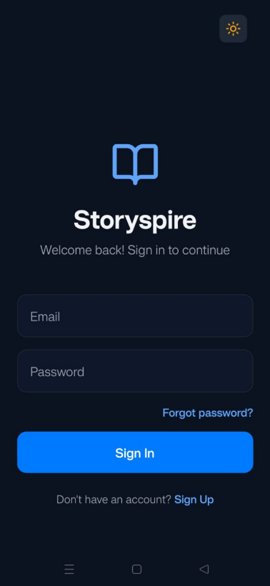
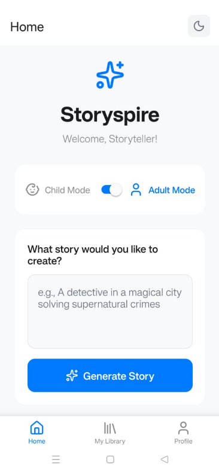
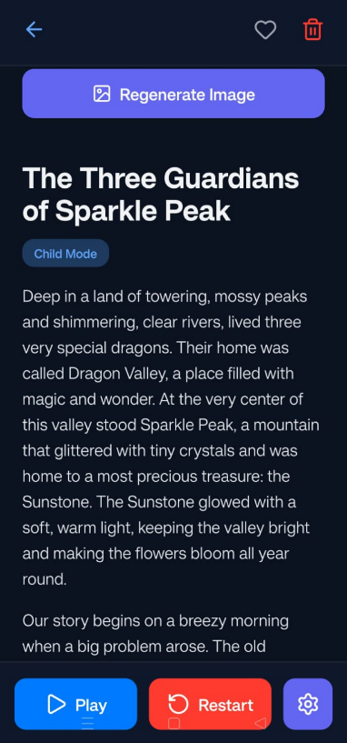
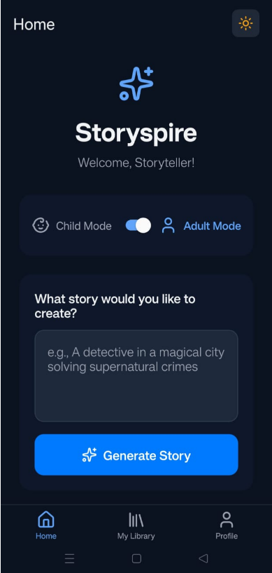
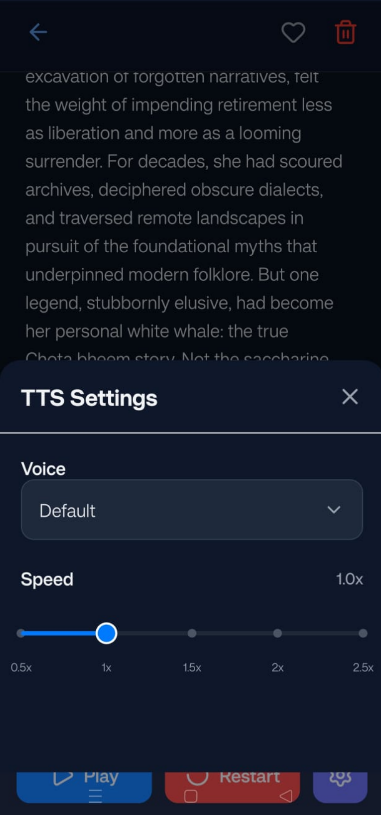
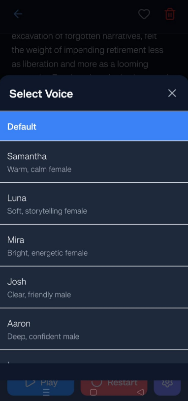
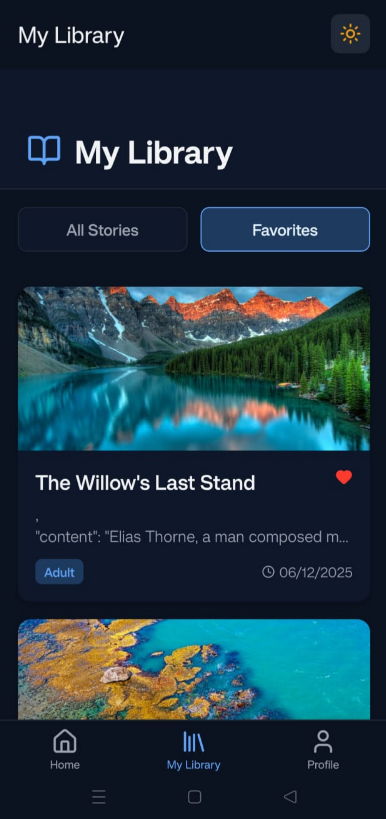
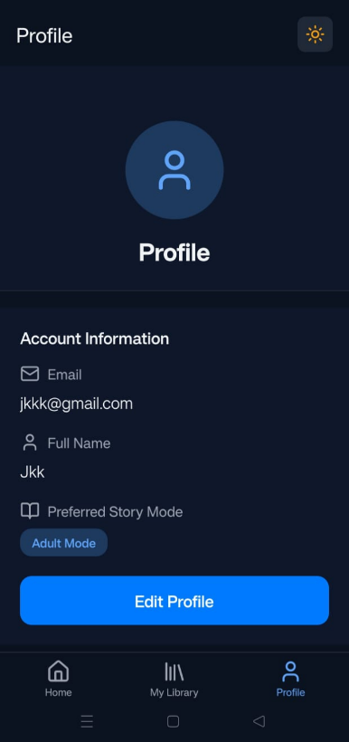

# Storyspire - AI Storyteller

A cross-platform mobile app that generates stories with images and narration using Google Gemini AI. Built with React Native (Expo), Supabase, and Google Gemini API.

**Repository**: https://github.com/Jaykeerthi04/storyspire-ai-storyteller
## 📸 App Preview

### 🔐 Authentication


### 🏠 Home Screen – Story Mode Toggle


### 📖 AI Story Generation


### 🎨 Home Screen


### 🔊 Text-to-Speech Settings


### 🔊 Voice Selection


### 📚 My Library


### 👤 Profile


## 🚀 Key Highlights

- 🔐 Secure authentication with Supabase Auth
- 🎨 AI-powered story & image generation using Google Gemini
- 🧒👨 Dual audience modes (Child / Adult toggle)
- 🔊 Text-to-Speech narration with multiple voices
- 📚 Persistent story library with favorites
- 🌗 Dark / Light theme support
- 🛡 Row Level Security (RLS) for user data isolation

## Features

- **Story Generation**: Generate creative, unique stories instantly with AI
- **Dual Audience Modes**:
  - **Child Mode**: Simple, short, fun stories optimized for ages 5-12
  - **Adult Mode**: Detailed, creative stories for adults, writers, and creative professionals
- **Text-to-Speech Narration**: Listen to your stories with natural-sounding voice narration (multiple voices available)
- **User Authentication**: Secure sign up and login with email
- **Story Library**: Save and manage all your generated stories
- **Favorites**: Bookmark your favorite stories for quick access
- **Profile Management**: Customize your profile, story preferences, and account settings
- **AI-Generated Images**: Each story comes with a relevant, contextual AI-generated image
- **Offline Access**: Stories are saved locally for offline reading

## Tech Stack

- **Frontend**: React Native (Expo SDK)
- **Backend**: Supabase (Database + Authentication)
- **AI**: Google Gemini API (Text Generation)
- **Speech**: Expo Speech API (Text-to-Speech)
- **Navigation**: Expo Router
- **Icons**: Lucide React Native

## Prerequisites

- Node.js 18+
- npm or yarn
- Supabase account + project
- Google Gemini API key
- Expo Go app (for mobile testing)
- Optional: Supabase CLI for local development: `npm i -g supabase`

## Setup Instructions

### 1) Install dependencies

```bash
npm install
```

### 2) Configure environment variables

Create or edit `.env` at the project root:

```env
EXPO_PUBLIC_SUPABASE_URL=your_supabase_url
EXPO_PUBLIC_SUPABASE_ANON_KEY=your_supabase_anon_key
EXPO_PUBLIC_GEMINI_API_KEY=your_gemini_api_key
# Optional
# EXPO_PUBLIC_UNSPLASH_ACCESS_KEY=your_unsplash_key
```

Notes:
- Names must start with `EXPO_PUBLIC_` to be bundled to the client.
- After editing `.env`, restart with cache clear: `npx expo start -c`.

### 3) Database setup

Migrations include:
- `profiles` and `stories` tables with RLS enabled.
- Idempotent RLS policies for read/write.
- `updated_at` triggers for both tables (idempotent).
- `public.handle_new_user()` and the `auth.users` trigger `on_auth_user_created` to auto-create a profile on signup (guarded and safe to re-run).

Apply via Supabase CLI:
```bash
# If needed: npx supabase login
# If needed: npx supabase link --project-ref <your-ref>
npx supabase db push
# If port 5432 is blocked, use the pooled DB URL from Dashboard:
# npx supabase db push --db-url "postgresql://postgres:<PASSWORD>@<HOST>:5432/postgres"
```

Or via Dashboard → SQL: run the SQL in `supabase/migrations/` in order.

### 4) Run the app

#### Development Mode (Expo Go)

```bash
npm run dev
```

Then:
- Scan the QR code with Expo Go app (iOS/Android)
- Press `w` to open in web browser

#### Build for Production (Web)

```bash
npm run build:web
```

## Project Structure

```
├── app/
│   ├── (tabs)/          # Tab navigation screens
│   │   ├── index.tsx    # Home screen (story generation)
│   │   ├── library.tsx  # Story library
│   │   └── profile.tsx  # User profile
│   ├── auth/            # Authentication screens
│   │   ├── login.tsx
│   │   └── register.tsx
│   ├── story/           # Story detail screens
│   │   └── [id].tsx     # Individual story view
│   └── _layout.tsx      # Root layout
├── contexts/
│   └── AuthContext.tsx  # Authentication context
├── lib/
│   └── supabase.ts      # Supabase client
├── services/
│   ├── gemini.ts        # Gemini API integration
│   └── tts.ts           # Text-to-Speech service
└── types/
    └── database.ts      # TypeScript types
```

## Usage

### Creating a Story

1. Sign up or log in to your account
2. Go to the Home tab
3. Select your audience mode (Child or Adult)
4. Enter your story idea/prompt
5. Tap "Generate Story"
6. Wait for the AI to create your story
7. View and listen to your story

### Managing Stories

- View all stories in the Library tab
- Filter by "All Stories" or "Favorites"
- Tap a story to read and listen
- Mark stories as favorites with the heart icon
- Delete stories with the trash icon

### Profile Settings

- Update your full name
- Change preferred story mode
- View account creation date
- Sign out

## API Configuration

### Google Gemini API

The app uses the Gemini 1.5 Pro model for story generation. The API is configured in `services/gemini.ts` with:

- Temperature: 0.9 (for creative output)
- Max tokens: 2048
- Custom prompts based on audience mode

### Supabase Configuration

Authentication and database are managed through Supabase with:

- Email/Password authentication
- Row Level Security (RLS) policies
- Real-time database updates
- Secure user data storage

## Free Tier Limitations

- **Gemini API**: Free tier includes 60 requests per minute
- **Supabase**: Free tier includes 500MB database, 1GB file storage, 2GB bandwidth
- **Expo**: Unlimited for development

## Security Features

- Row Level Security (RLS) on all database tables
- Secure authentication with Supabase
- API keys stored in environment variables
- User data isolation (users can only access their own data)

## Troubleshooting

### Gemini API Errors

If you see "Please set your Gemini API key":
1. Verify your API key in `.env`
2. Restart the Expo development server
3. Clear cache: `expo start -c`

### Supabase Connection Issues

If authentication fails:
1. Check your internet connection
2. Verify Supabase credentials in `.env`
3. Check Supabase dashboard for service status

### Text-to-Speech Not Working

- TTS only works on physical devices or emulators (not in web browser)
- On iOS, ensure device is not in silent mode
- Check device volume settings

## Platform Support

- **iOS**: Full support (requires Expo Go or dev build)
- **Android**: Full support (requires Expo Go or dev build)
- **Web**: Supported (TTS may have limited functionality)

## Getting Help

- Check the [Troubleshooting](#troubleshooting) section
- Review Supabase documentation: https://supabase.com/docs
- Google Gemini documentation: https://ai.google.dev/docs
- Expo documentation: https://docs.expo.dev/

## Contributing

Contributions are welcome! Please feel free to submit a Pull Request. For major changes, please open an issue first to discuss what you would like to change.

1. Fork the repository
2. Create your feature branch (`git checkout -b feature/amazing-feature`)
3. Commit your changes (`git commit -m 'Add some amazing feature'`)
4. Push to the branch (`git push origin feature/amazing-feature`)
5. Open a Pull Request

## License

MIT

## Credits

- Built with [Expo](https://expo.dev/)
- Powered by [Google Gemini AI](https://ai.google.dev/)
- Backend by [Supabase](https://supabase.com/)
- Stock photos from [Pexels](https://www.pexels.com/)
